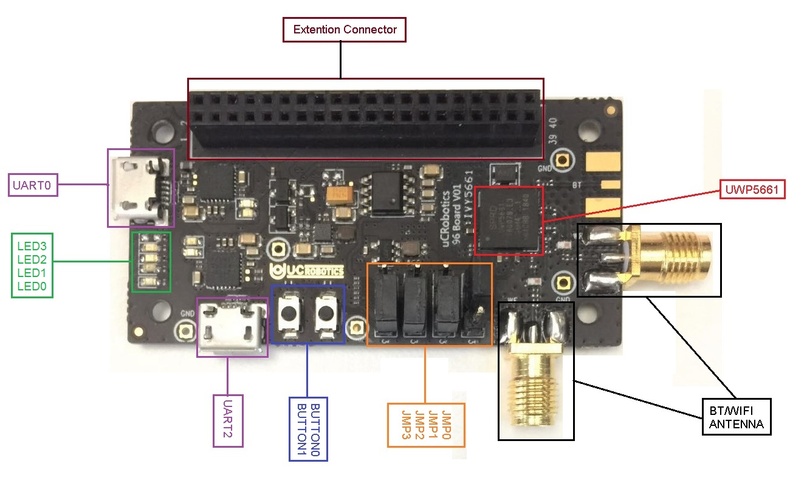

# <center>IVY5661 Manual</center>  
# <center>English</center>  
<center>v1.0 2019.04</center>  

--- 

## Catalog   
### **1、About IVY5661**  
### **2、Hardware Introduction**  
>2.1 Hardware  
>2.2 Hardware Layout  
>2.3 Jumper  
>>2.3.1 Jumper Description  
>>2.3.2 Boot Option  

>2.4 Expansions Definitions  
>2.5 JTAG  
>2.6 Buttons and LEDs  
  
### **3、First Bootup**  
>3.1 Environment  
>3.2 Download Binary  
>3.3 Binary Composition  
>3.4 Update Binary  

### **4、Compile**  
>4.1 Hardware Environment  
>4.2 Software Environment  
>4.3 Sync Code  
>4.4 How to Compile  

---  
## 1. About IVY5661  
The IVY5661, which measures only 6cm x 3cm, is a micro-development board manufactured by uCRobotics. IVY5661 follows the Linaro 96boards IoT hardware design specification. Utilizing the 28nm UniSoC UWP5661 SoC, it has an embedded ARM Cortex-M4 CPU with a frequency range of 416MHz. Built-in 32Mbit storage space; supports Wi-Fi IEEE 802.11ac 2x2 and Bluetooth 5. High-capacity storage and rich RF capabilities help users develop more complex and diverse IoT software.  
When it comes to software issues that developers are most concerned about, IVY5661 supports the Zephyr operating system. We all know that Zephyr is a real-time operating system for IoT devices from the Linux Foundation. Zephyr's strengths are not only that it is born, but also that it  

- Supports modularity: you can use the native Zephyr RTOS, or you can customize your own solution.  
- Improve the integrated communication protocol stack, including device-to-device connections. The Zephyr team has joined the networking capabilities. The low-power Bluetooth (BLE) implementation was written from the ground up, and the IP protocol stack in the open source Contiki RTOS was ported to support IPv6, including low-power 6LoWPAN. Thanks to Zephyr's comprehensive network protocol stack support, the IVY5661's dual-mode RF solution is being leveraged.
- Security: A Zephyr image can only be run as a single application, statically linked at compile time, and run in a single address space. Dynamically loaded modules are not supported, which greatly reduces malware attacks.  
- Zephyr offers a wide range of services: multi-threaded services, interrupt services, synchronization between threads, data transfer services between threads, power management services, and more.
- Lightweight: The size of the Zephyr program of IVY5661 is less than 200kb. The memory usage is low.  
- Real-time: The advantage of the real-time operating system compared to the traditional operating system is self-evident, and the application direction is also an area where the data transmission speed is relatively high, which cannot be applied by the traditional operating system.  
- Community Support: Zephyr is an open source system sponsored by the Linux Foundation. Community support is perfect.   

---  
## 2. Hardware Introduction 
We're about to introduce the hardware config and hardware layout of IVY5661.   
### 2.1 Hardware  
|  Name |  Description  |
| :----| :--------| 
|  SoC |  UWP5661@28nm  |
| CPU | ARM Cortex-M4 Daul Core | 
| Clock freq | 416MHz | 
| Storage | 32Mbit |
| Wi-Fi | IEEE802.11ac 2x2 | 
| Bluetooth | Bluetooth 5 |
| USB  | 2 x MicroUSB |
| Expansion Interface | UART/I2C/I2S/GPIO | 
| LED | 4 user LED |
| Button | 2 Reset and User button |
| Power Source | Micro USB |
| OS Support | Zephyr |
| Size | 60 x 30 mm |    
### 2.2 Hardware Layout  
  
<center>2.2 IVY5661 Hardware Layout</center>  
### 2.3 Jumper  
#### 2.3.1 Jumper Description  
|  Name  |        Description       | default |  
| :---: | :---------------: | :----:  | 
| JMP0 |   Boot Switch 0   |   0 |
| JMP1 |  Boot Switch 1 | 1 |
| JMP2 | UART/I2C Switch 0 | 1(UART) |
| JMP3 | UART/I2C Switch 0 | 1(UART) |  
   
*`Notice: "0" means connect pin1 with pin2, "1" means connect pin2 with pin3`*
#### 2.3.2 Boot Option  
| JMP0 | JMP1 |      Boot From     | 
| :--: | :--: | :-------------: |  
|  0 | 1 | Flash（Default）| 
| 1 | 0 | NOR Flash（Update mode） |   
### 2.4 Expansions Definations  
| Number |   Name    |       Function       | Dirction   | GPIO组 | GPIO Pin | Default | 
| :--: | :-----: | :------------------ | :--- | :---: | :-----: | :---: |  
| 1 | GND | connect with ground | —— | —— | —— | —— | 
| 2 | GND | connect with ground | —— | —— | —— | —— |
| 3 | U1CTS | <br>0: U1CTS</br><br>3: GPIO24</br><br>5: PCIe_DBG11</br> | <br>I</br><br>I/O/T</br><br>O</br> | B | 8 | FUNC0 | 
| 4 | PWR_BTN_N | <br>external access;</br><br>control power supply of board. | —— | —— | —— | —— | 
| 5 | U1TXD | <br>0: U1TXD</br><br>3: GPIO21</br><br>5: PCIe_DBG8</br> | <br>O</br><br>I/O/T</br><br>O</br> | B | 5 | FUNC0 | 
| 6 | RST_N | reset board | I | —— | —— | —— |
| 7 | U1RXD | <br>0: U1RXD</br><br>3: GPIO22</br><br>5: PCIe_DBG9</br> | <br>I</br><br>I/O/T</br><br>O</br> | B | 6 | FUNC0 | 
| 8 | SD_CLK | <br>0: SD_CLK</br><br>3: GPIO19</br> <br>5: PCIe_DBG4</br> | <br>I/O/T</br><br>I/O/T</br><br>O</br> | B | 3 | FUNC0 | 
| 9 | U1RTS | <br>0: U1RTS</br><br>3: GPIO23</br><br>5: PCIe_DBG10</br> | <br>O</br><br>I/O/T</br><br>O</br> | B | 7 | FUNC0 | 
| 10 | SD_D0 | <br>0: SD_D0</br><br>3: GPIO18</br><br>5: PCIe_DBG3</br> | <br>I/O/T</br><br>I/O/T</br><br>O</br> | B | 2 | FUNC0 | 
| 11 | U2TXD | <br>0: PCIE_WAKE_L</br><br>1: U2TXD(G1)</br><br>3: GPIO42</br> | <br>I/O/T</br><br>O</br><br>I/O/T</br> | C | 10 | FUNC0 | 
| 12 | SD_CMD | <br>0: SD_CMD</br><br>3: GPIO20</br><br>4: DB7(G1)</br><br>5: PCIe_DBG5</br> | <br>I/O/T</br><br>I/O/T</br><br>O</br><br>0</br> | B | 4 | FUNC0 | 
| 13 | U2RXD | <br>0: PCIE_RST_L</br><br>1: U2RXD(G1)</br><br>3: GPIO41</br> | <br>I</br><br>I</br><br>I/O/T</br> | C | 9 | FUNC0 | 
| 14 | SD_D1 | <br>0: SD_D1</br><br>3: GPIO17</br><br>5: PCIe_DBG2</br> | <br>I/O/T</br><br>I/O/T</br><br>O</br> | B | 1 | FUNC0 | 
| 15 | I2CSCL | <br>0: U3RXD</br><br>1: I2C_SCL</br><br>3: GPIO31</br><br>5: PCIe_DBG7</br> | <br>I</br><br>I/O/T</br><br>I/O/T</br><br>O</br> | C | 15 | FUNC0 | 
| 16 | IISRCK | <br>0: IISLRCK</br><br>1: IIS1LRCK</br><br>2: COEX5</br><br>3: GPIO6</br>4: DB2(G0)</br><br>5: WB11</br> | <br>I/O/T</br><br>I/O/T</br>I/O</br><br>I/O/T</br><br>O</br><br>O</br> | A | 6 | FUNC0 | 
| 17 | I2CSDA | <br>0: U3TXD</br><br>: I2C_SDA</br>3: GPIO30</br><br>5: PCIe_DBG6</br> | <br>O</br><br>I/O/T</br><br>I/O/T</br><br>O</br> | B | 14 | FUNC0 | 
| 18 | IISCLK | <br>0: IISCLK</br><br>1: IIS1CK</br><br>2: COEX4</br><br>3: GPIO5</br><br>4: DB1(G0)</br><br>5: WB10</br> | <br>I/O/T</br><br><br>I/O/T</br><br>I/O</br><br>I/O/T</br><br>O</br><br>O</br> | A | 5 | FUNC0 | 
| 20 | IISD0 | <br>0: IISDO</br><br>1: IIS1DO</br><br>2: COEX3</br><br>3: GPIO4</br><br>4: DB0(G0)</br><br>5: WB9</br> | <br>O/T</br><br>O/T</br><br>I/O</br><br>I/O/T</br><br>O</br><br>O</br> | A | 4 | FUNC0 | 
| 22 | IISDI | <br>0: IISDI</br><br>2: COEX6</br><br>3: GPIO7</br><br>4: DB3(G0)</br><br>5: WB12</br> | <br>I</br><br>I/O</br><br>I/O/T</br><br>O</br><br>O</br> | A | 7 | FUNC0 | 
| 23 | INT | <br>0: INT</br><br>2: COEX7</br><br>3: GPIO10</br> | <br>O</br><br>I/O</br><br>I/O/T</br> | A | 10 | FUNC0 | 
| 24 | GPIO25 | <br>0: GNSS_LNA_EN</br><br>2: FDMA_CEN</br><br>3: GPIO25</br> | <br>O</br><br>I</br><br>I/O/T</br> | B | 9 | FUNC0 | 
| 25 | WCI_2_TXD | <br>0: WCI_2_TXD</br><br>2: COEX1</br><br>3: GPIO9</br><br>4: DB7(G0)</br><br>5: WB4</br> | <br>O</br><br>I/O</br><br>I/O/T</br><br>O</br><br>O</br> | A | 9 | FUNC0 | 
| 26 | WCI)2_RXD | <br>0: WCI_2_RXD</br><br>2: COEX0</br><br>3: GPIO8</br><br>4: DB2(G1)</br><br>5: WB3</br> | <br>O</br><br>I/O</br><br>I/O/T</br><br>O</br><br>O</br> | A | 8 | FUNC0 | 
| 27 | RFCTL0 | <br>0: RFCTL0</br><br>2: SOC_DBG0</br><br>3: GPIO32</br><br>5: WB13</br> | <br>O</br><br>O</br><br>I/O/T</br><br>O</br> | C | 0 | FUNC3 | 
| 28 | GIPO43 | <br>0: U0TXD</br><br>3: GPIO43</br><br>5: PCIe_DBG12</br> | <br>O</br><br>I/O/T</br><br>O</br> | C | 11 | FUNC0 | 
| 29 | RFCTL1 | <br>0: RFCTL1</br><br>2: SOC_DBG1</br><br>3: GPIO33</br><br>5: WB14</br> | <br>O</br><br>O</br><br>I/O/T</br><br>O</br> | C | 1 | FUNC3 | 
| 30 | RFCTL3 | <br>0: RFCTL3</br><br>2: SOC_DBG3</br><br>3: GPIO35</br><br>5: WB16</br> | <br>O</br><br>O</br><br>I/O/T</br><br>O</br> | C | 3 | FUNC3 | 
| 31 | RFCTL2 | <br>0: RFCTL2</br><br>2: SOC_DBG2</br><br>3: GPIO34</br><br>5: WB15</br> | <br>O</br><br>O</br><br>I/O/T</br><br>O</br> | C | 2 | FUNC3 | 
| 32 | RFCTL4 | <br>0: RFCTL4</br><br>2: SOC_DBG4</br><br>3: GPIO36</br><br>5: WB17</br> | <br>O</br><br>O</br><br>I/O/T</br><br>O</br> | C | 4 | FUNC3 | 
| 33 | MTMS | <br>0: MTMS</br><br>1: PPS(G0)</br><br>2: FDMA_MISO</br><br>3: GPIO11</br><br>4: DB0(G1)</br><br>5: WB5</br> | <br>I/O</br><br>O</br><br>O</br><br>I/O/T</br><br>O</br><br>O</br> | A | 11 | FUNC0 | 
| 34 | MTCK | <br>0: MTCK</br><br>1: T_DIG(G0)</br><br>2: FDMA_MOSI</br><br>3: GPIO12</br><br>4: DB1(G1)</br><br>5: WB6</br> | A | 12 | FUNC0 | 
| 35 | VDD1V8 | connect with 1.8V VDD | —— | —— | —— | —— | 
| 37 | USB_VBUS | connect with USB power supply | —— | —— | —— | —— | 
| 39 | GND | connect with ground  | —— | —— | —— | —— | 
| 40 | GND | connect with ground | —— | —— | —— | —— | 

### 2.5 JTAG  
If you want to debug program in gdb mode, it requires JTAG connect with the external connector on ivy5661. J-Link is the recommended JTAG tool, it has been tested by many devolopers, the usage guide can be found [here](https://unisoc.github.io/sdk/debug/).

The minimal requirement for use JTAG interface is 4 wires connect listed below.
 
|  20-pin JTAG/SWD  |   40-pin extention connector    | 
| :--- | :--------------- | 
| 1 - VCC | 35 - VCC | 
| 3 TRST | | 
| 5 - TDI | | 
| 7 - TMS/SWDIO | 33 - TMS | 
| 9 - TCK/SWCLK | 34 - TCK | 
| 11 - RTCK | | 
| 13 - TDO/SWO | | 
| 15 - RESET | | 
| 17 - NC | |
| 19 - NC | | 
| 2 - NC | | 
| 20 - GND | 39 - GND | 

### 2.6 Buttons and LEDs  
| Name | Control Pin | Description |
| :--- | :----- | :--- | 
| BUTTON0 | RST_N | Reset Button | 
| BUTTON1 | GPIOA0 | Custom Button | 
| LED0 | connect to GND and VDD | keeping light on till power on | 
| LED1 | GPIOA2 | low for light_on, high for light_off | 
| LED2 | GPIOA3 | low for light_on, high for light_off | 
| LED3 | GPIOA1 | low for light_on, high for light_off |  


----  
## 3. First Bootup  
We are about bootup IVY5661 96boards for the first time.    
### 3.1 Environment  
The work we have done is on Linux. Debian/Ubuntu is highly recommanded(All the instructions on this manual are according to Debian 9 Stretch).  
How to download Debian：[https://www.debian.org/CD/](https://www.debian.org/CD/)  
#### a. Install Operating System  
#### b. Update the system to the newest  
`$ sudo apt update`  
`$ sudo apt upgrade`  
#### c. Install dloader  
`$ wget https://github.com/unisoc/dloader/releases/download/unisoc-v0.3.1/dloader_0.3.1-1_amd64.deb`  
`$ sudo dpkg -i dloader_*.deb`  
***You can also make your own dloader***  
`$ git clone https://github.com/unisoc/dloader.git`  
`$ ./configure`  
`$ make`  
`$ sudo make install`  
### 3.2 Download Binary  
Link：[https://github.com/96boards/documentation/tree/master/iot/ivy5661/downloads](https://github.com/96boards/documentation/tree/master/iot/ivy5661/downloads)  
### 3.3 Binary Composition
- `fdl*.bin` - Flash downloader  
- `mcuboot-pubkey*.bin` - Bootloader  
- `zephyr-signed-ota*.bin` - Kernel  
- `wcn-modem*` - WCN Modem  

### 3.4 Update Binary  
#### a. Connect IVY5661 with your PC through MicroUSB to USB-Type A. Releas tty device.    
#### b. Into download folder and uncompress the file。 
```
$ tar -jxvf prebuild-repeater.tar.bz2  
$ cd prebuild-repeater.tar.bz2  
$ ./update_fw.sh  
```

---  
## 4. Compile  
### 4.1 Hardware Environment  
Quad Core + > 4GB RAM is highly recommanded.    
### 4.2 Software Environment  
**OS:**Debian/Ubuntu is highly recommanded(All the instructions on this manual are according to Debian 9 Stretch). 
How to download Debian：[https://www.debian.org/CD/](https://www.debian.org/CD/)  
#### a. Keep the system to the newest  
```
$ sudo apt update  
$ sudo apt upgrade  
```  

#### b. Install Necessary Library and Software  
```
sudo apt install --no-install-recommends git cmake ninja-build gperf \
  ccache dfu-util device-tree-compiler wget \
  python3-pip python3-setuptools python3-wheel xz-utils file make gcc \
  gcc-multilib  
```  
```  
$ sudo apt install repo 
```
#### c. Install Zephyr SDK  
```
$ wget https://github.com/zephyrproject-rtos/sdk-ng/releases/download/v0.10.0/zephyr-sdk-0.10.0-setup.run
$ sh zephyr-sdk-0.10.0-setup.run
```  
Zephyr SDK will be defaultly installed to `/opt/zephyr-sdk`, or you can install it to the right folder you want.   
#### d. Config Environment  
```  
$ export ZEPHYR_TOOLCHAIN_VARIANT=zephyr  
$ export ZEPHYR_SDK_INSTALL_DIR=<sdk installation directory>  
```   

### 4.3 Sync Code 
```  
$ mkdir unisoc_zephyr_sdk && cd unisoc_zephyr_sdk  
$ repo init -u https://github.com/unisoc/manifests.git -b unisoc_1.13
$ repo sync
$ repo start --all unisoc_1.13  
```   
### 4.4 Compile  
A folder which contains the code of Zephyr applications named `apps/` is under SDK. You need to point out which application you would like to compile when compiling.  
`$ BOARD=96b_ivy5661 PROFILE=repeater make`  