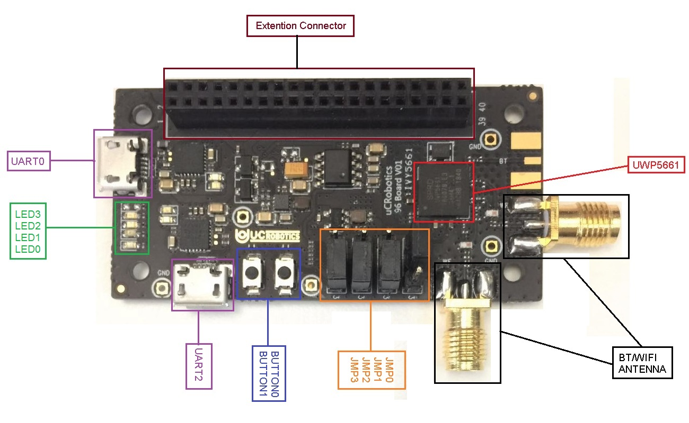

# <center>IVY5661使用手册</center>  
# <center>中文</center>  
<center>v1.0 2019.04</center>  

--- 

## 目录  
### **1、关于IVY5661**  
### **2、硬件介绍**  
>2.1 硬件配置  
>2.2 硬件布局  
>2.3 跳帽  
>>2.3.1 跳帽描述  
>>2.3.2 启动选择  

>2.4 扩展接口定义  
>2.5 JTAG连接  
>2.6 按钮和LED灯  
  
### **3、第一次使用**  
>3.1 使用环境  
>3.2 下载二进制文件  
>3.3 二进制文件构成  
>3.4 如何烧写二进制文件  

### **4、编译**  
>4.1 硬件环境  
>4.2 软件环境  
>4.3 代码下载  
>4.4 编译命令  

---  
## 1. 关于IVY5661  

---  
## 2. 硬件介绍 
这一章节主要介绍IVY5661的硬件配置，以及硬件布局。使用户对IVY5661上的各个物理控件有基本的了解。   
### 2.1 硬件配置  
### 2.2 硬件布局  
  
<center>图2.2 IVY5661硬件布局图</center>  
### 2.3 跳帽  
#### 2.3.1 跳帽描述  
|  名称  |        描述       | default |  
| :---: | :---------------: | :----:  | 
| JMP0 |   Boot Switch 0   |   0 |
| JMP1 |  Boot Switch 1 | 1 |
| JMP2 | UART/I2C Switch 0 | 1(UART) |
| JMP3 | UART/I2C Switch 0 | 1(UART) |  

*`注意：0代表了连接Pin1和Pin2，1代表了连接了Pin2和Pin3。`*  
#### 2.3.2 启动选择  
| JMP0 | JMP1 |      启动方式     | 
| :--: | :--: | :-------------: |  
|  0 | 1 | 从flash启动（默认启动方式）| 
| 1 | 0 | 从NOR FLASH启动（烧写模式） |   
### 2.4 扩展接口定义  
| 编号 |   名称    |       功能定义       | 方向   | GPIO组 | GPIO Pin | Default | 
| :--: | :-----: | :------------------ | :--- | :---: | :-----: | :---: |  
| 1 | GND | 与GND连接 | —— | —— | —— | —— | 
| 2 | GND | 与GND连接 | —— | —— | —— | —— |
| 3 | U1CTS | <br>0: U1CTS</br><br>3: GPIO24</br><br>5: PCIe_DBG11</br> | <br>I</br><br>I/O/T</br><br>O</br> | B | 8 | FUNC0 | 
| 4 | PWR_BTN_N | <br>external access;</br><br>control power supply of board. | —— | —— | —— | —— | 
| 5 | U1TXD | <br>0: U1TXD</br><br>3: GPIO21</br><br>5: PCIe_DBG8</br> | <br>O</br><br>I/O/T</br><br>O</br> | B | 5 | FUNC0 | 
| 6 | RST_N | reset board | I | —— | —— | —— |
| 7 | U1RXD | <br>0: U1RXD</br><br>3: GPIO22</br><br>5: PCIe_DBG9</br> | <br>I</br><br>I/O/T</br><br>O</br> | B | 6 | FUNC0 | 
| 8 | SD_CLK | <br>0: SD_CLK</br><br>3: GPIO19</br> <br>5: PCIe_DBG4</br> | <br>I/O/T</br><br>I/O/T</br><br>O</br> | B | 3 | FUNC0 | 
| 9 | U1RTS | <br>0: U1RTS</br><br>3: GPIO23</br><br>5: PCIe_DBG10</br> | <br>O</br><br>I/O/T</br><br>O</br> | B | 7 | FUNC0 | 
| 10 | SD_D0 | <br>0: SD_D0</br><br>3: GPIO18</br><br>5: PCIe_DBG3</br> | <br>I/O/T</br><br>I/O/T</br><br>O</br> | B | 2 | FUNC0 | 
| 11 | U2TXD | <br>0: PCIE_WAKE_L</br><br>1: U2TXD(G1)</br><br>3: GPIO42</br> | <br>I/O/T</br><br>O</br><br>I/O/T</br> | C | 10 | FUNC0 | 
| 12 | SD_CMD | <br>0: SD_CMD</br><br>3: GPIO20</br><br>4: DB7(G1)</br><br>5: PCIe_DBG5</br> | <br>I/O/T</br><br>I/O/T</br><br>O</br><br>0</br> | B | 4 | FUNC0 | 
| 13 | U2RXD | <br>0: PCIE_RST_L</br><br>1: U2RXD(G1)</br><br>3: GPIO41</br> | <br>I</br><br>I</br><br>I/O/T</br> | C | 9 | FUNC0 | 
| 14 | SD_D1 | <br>0: SD_D1</br><br>3: GPIO17</br><br>5: PCIe_DBG2</br> | <br>I/O/T</br><br>I/O/T</br><br>O</br> | B | 1 | FUNC0 | 
| 15 | I2CSCL | <br>0: U3RXD</br><br>1: I2C_SCL</br><br>3: GPIO31</br><br>5: PCIe_DBG7</br> | <br>I</br><br>I/O/T</br><br>I/O/T</br><br>O</br> | C | 15 | FUNC0 | 
| 16 | IISRCK | <br>0: IISLRCK</br><br>1: IIS1LRCK</br><br>2: COEX5</br><br>3: GPIO6</br>4: DB2(G0)</br><br>5: WB11</br> | <br>I/O/T</br><br>I/O/T</br>I/O</br><br>I/O/T</br><br>O</br><br>O</br> | A | 6 | FUNC0 | 
| 17 | I2CSDA | <br>0: U3TXD</br><br>: I2C_SDA</br>3: GPIO30</br><br>5: PCIe_DBG6</br> | <br>O</br><br>I/O/T</br><br>I/O/T</br><br>O</br> | B | 14 | FUNC0 | 
| 18 | IISCLK | <br>0: IISCLK</br><br>1: IIS1CK</br><br>2: COEX4</br><br>3: GPIO5</br><br>4: DB1(G0)</br><br>5: WB10</br> | <br>I/O/T</br><br><br>I/O/T</br><br>I/O</br><br>I/O/T</br><br>O</br><br>O</br> | A | 5 | FUNC0 | 
| 20 | IISD0 | <br>0: IISDO</br><br>1: IIS1DO</br><br>2: COEX3</br><br>3: GPIO4</br><br>4: DB0(G0)</br><br>5: WB9</br> | <br>O/T</br><br>O/T</br><br>I/O</br><br>I/O/T</br><br>O</br><br>O</br> | A | 4 | FUNC0 | 
| 22 | IISDI | <br>0: IISDI</br><br>2: COEX6</br><br>3: GPIO7</br><br>4: DB3(G0)</br><br>5: WB12</br> | <br>I</br><br>I/O</br><br>I/O/T</br><br>O</br><br>O</br> | A | 7 | FUNC0 | 
| 23 | INT | <br>0: INT</br><br>2: COEX7</br><br>3: GPIO10</br> | <br>O</br><br>I/O</br><br>I/O/T</br> | A | 10 | FUNC0 | 
| 24 | GPIO25 | <br>0: GNSS_LNA_EN</br><br>2: FDMA_CEN</br><br>3: GPIO25</br> | <br>O</br><br>I</br><br>I/O/T</br> | B | 9 | FUNC0 | 
| 25 | WCI_2_TXD | <br>0: WCI_2_TXD</br><br>2: COEX1</br><br>3: GPIO9</br><br>4: DB7(G0)</br><br>5: WB4</br> | <br>O</br><br>I/O</br><br>I/O/T</br><br>O</br><br>O</br> | A | 9 | FUNC0 | 
| 26 | WCI)2_RXD | <br>0: WCI_2_RXD</br><br>2: COEX0</br><br>3: GPIO8</br><br>4: DB2(G1)</br><br>5: WB3</br> | <br>O</br><br>I/O</br><br>I/O/T</br><br>O</br><br>O</br> | A | 8 | FUNC0 | 
| 27 | RFCTL0 | <br>0: RFCTL0</br><br>2: SOC_DBG0</br><br>3: GPIO32</br><br>5: WB13</br> | <br>O</br><br>O</br><br>I/O/T</br><br>O</br> | C | 0 | FUNC3 | 
| 28 | GIPO43 | <br>0: U0TXD</br><br>3: GPIO43</br><br>5: PCIe_DBG12</br> | <br>O</br><br>I/O/T</br><br>O</br> | C | 11 | FUNC0 | 
| 29 | RFCTL1 | <br>0: RFCTL1</br><br>2: SOC_DBG1</br><br>3: GPIO33</br><br>5: WB14</br> | <br>O</br><br>O</br><br>I/O/T</br><br>O</br> | C | 1 | FUNC3 | 
| 30 | RFCTL3 | <br>0: RFCTL3</br><br>2: SOC_DBG3</br><br>3: GPIO35</br><br>5: WB16</br> | <br>O</br><br>O</br><br>I/O/T</br><br>O</br> | C | 3 | FUNC3 | 
| 31 | RFCTL2 | <br>0: RFCTL2</br><br>2: SOC_DBG2</br><br>3: GPIO34</br><br>5: WB15</br> | <br>O</br><br>O</br><br>I/O/T</br><br>O</br> | C | 2 | FUNC3 | 
| 32 | RFCTL4 | <br>0: RFCTL4</br><br>2: SOC_DBG4</br><br>3: GPIO36</br><br>5: WB17</br> | <br>O</br><br>O</br><br>I/O/T</br><br>O</br> | C | 4 | FUNC3 | 
| 33 | MTMS | <br>0: MTMS</br><br>1: PPS(G0)</br><br>2: FDMA_MISO</br><br>3: GPIO11</br><br>4: DB0(G1)</br><br>5: WB5</br> | <br>I/O</br><br>O</br><br>O</br><br>I/O/T</br><br>O</br><br>O</br> | A | 11 | FUNC0 | 
| 34 | MTCK | <br>0: MTCK</br><br>1: T_DIG(G0)</br><br>2: FDMA_MOSI</br><br>3: GPIO12</br><br>4: DB1(G1)</br><br>5: WB6</br> | A | 12 | FUNC0 | 
| 35 | VDD1V8 | 与1.8V的VDD相连 | —— | —— | —— | —— | 
| 37 | USB_VBUS | 与USB相连供电 | —— | —— | —— | —— | 
| 39 | GND | 与GND连接 | —— | —— | —— | —— | 
| 40 | GND | 与GND连接 | —— | —— | —— | —— | 

### 2.5 JTAG连接  
JTAG调试最少需要连接4线，连接方式如下表： 
 
|  20-pin JTAG/SWD  |   40-pin 扩展    | 
| :--- | :--------------- | 
| 1 - VCC | 35 - VCC | 
| 3 TRST | | 
| 5 - TDI | | 
| 7 - TMS/SWDIO | 33 - TMS | 
| 9 - TCK/SWCLK | 34 - TCK | 
| 11 - RTCK | | 
| 13 - TDO/SWO | | 
| 15 - RESET | | 
| 17 - NC | |
| 19 - NC | | 
| 2 - NC | | 
| 20 - GND | 39 - GND | 

### 2.6 按钮和LED灯  
| 名称 | 控制管脚 | 描述 |
| :--- | :----- | :--- | 
| BUTTON0 | RST_N | Reset Button | 
| BUTTON1 | GPIOA0 | Custom Button | 
| LED0 | connect to GND and VDD | keeping light on till power on | 
| LED1 | GPIOA2 | low for light_on, high for light_off | 
| LED2 | GPIOA3 | low for light_on, high for light_off | 
| LED3 | GPIOA1 | low for light_on, high for light_off |  


----  
## 3. 第一次使用  
在这一章节，我们将开始正式使用IVY5661 96boards开发板。  
### 3.1 使用环境  
目前，我们的所有工作将会在Linux上完成，我们推荐使用Debian/Ubuntu主机（本操作手册上的所有工作将会在Debian 9 Stretch上完成）。  
Debian系统下载地址：[https://www.debian.org/CD/](https://www.debian.org/CD/)  
#### a. 完成安装操作系统  
#### b. 将系统保持最新  
`$ sudo apt update`  
`$ sudo apt upgrade`  
#### c. 安装dloader  
`$ wget https://github.com/unisoc/dloader/releases/download/unisoc-v0.3.1/dloader_0.3.1-1_amd64.deb`  
`$ sudo dpkg -i dloader_*.deb`  
***你也可以自己编译dloader***  
`$ git clone https://github.com/unisoc/dloader.git`  
`$ ./configure`  
`$ make`  
`$ sudo make install`  
### 3.2 下载二进制文件  
下载地址：[https://github.com/96boards/documentation/tree/master/iot/ivy5661/downloads](https://github.com/96boards/documentation/tree/master/iot/ivy5661/downloads)  
### 3.3 二进制文件构成  
- `fdl*.bin` - Flash downloader  
- `mcuboot-pubkey*.bin` - Bootloader  
- `zephyr-signed-ota*.bin` - Kernel  
- `wcn-modem*` - WCN Modem  

### 3.4 如何烧写二进制文件  
#### a. 使用MircroUSB - USB-TypeA的线缆将IVY5661与PC相连。并关闭PC上所有串口工具以释放设备。  
#### b. 进入下载完二进制的目录，并解压。 
```
$ tar -jxvf prebuild-repeater.tar.bz2  
$ cd prebuild-repeater.tar.bz2  
$ ./update_fw.sh  
```

---  
## 4. 编译  
### 4.1 硬件环境  
我们建议使用>四核+>4GB RAM以上PC进行编译。  
### 4.2 软件环境  
**OS:**我们推荐使用Debian/Ubuntu主机（本操作手册上的所有工作将会在Debian 9 Stretch上完成）。 
Debian系统下载地址：[https://www.debian.org/CD/](https://www.debian.org/CD/)  
#### a. 更新系统至最新  
```
$ sudo apt update  
$ sudo apt upgrade  
```  

#### b. 安装必要依赖和软件 
```
sudo apt-get install --no-install-recommends git cmake ninja-build gperf \
  ccache dfu-util device-tree-compiler wget \
  python3-pip python3-setuptools python3-wheel xz-utils file make gcc \
  gcc-multilib
```  
#### c. 安装Zephyr SDK  
```
$ wget https://github.com/zephyrproject-rtos/sdk-ng/releases/download/v0.10.0/zephyr-sdk-0.10.0-setup.run
$ sh zephyr-sdk-0.10.0-setup.run
```  


### 4.3 代码下载  
### 4.4 编译命令  